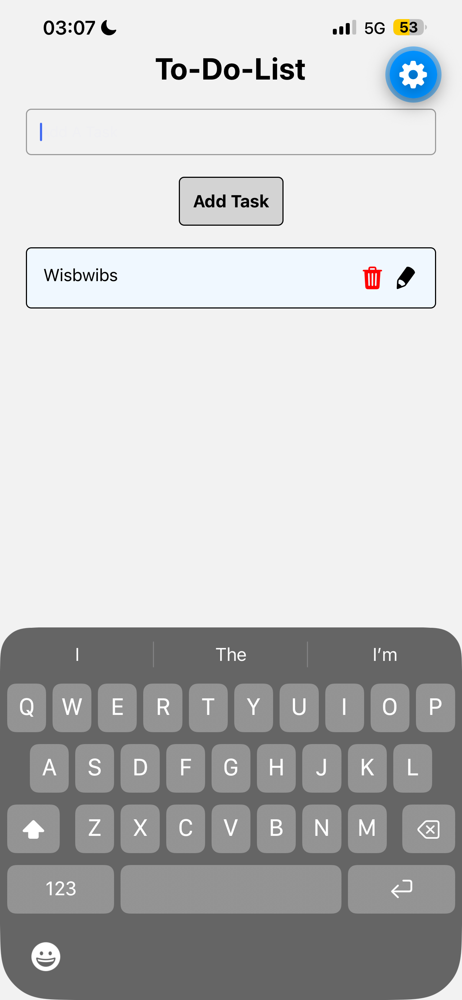
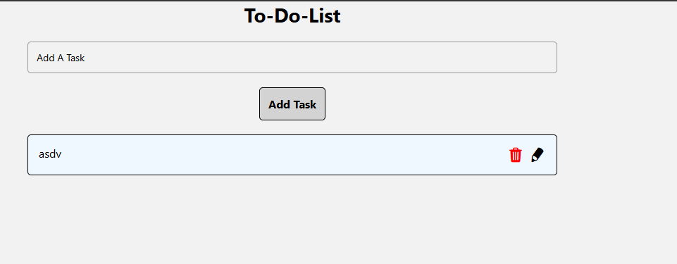

# To-Do-List 📝

A simple to-do list app built with [Expo](https://expo.dev) and React Native. Type a task, tap **Add Task**, and it appears in a scrollable list of cards below. Each task card has a trash icon to delete it and a pencil icon for editing. If you try to add an empty task, the app blocks it and shows an error — a native alert on iOS/Android, and red error text on the web.

## What the app does

- **Add tasks** — a `TextInput` at the top of the screen accepts a new task; a `Pressable` "Add Task" button appends it to the list.
- **View tasks** — tasks render in a `FlatList`, each one styled as a padded card.
- **Delete tasks** — every card has a red trash icon that removes that task from the list.
- **Edit affordance** — every card also has a pencil icon for editing the task.
- **Empty-input validation** — blank or whitespace-only tasks are rejected with a platform-appropriate error message.

The screen lives in [src/app/index.tsx](src/app/index.tsx), using Expo Router for file-based routing.

## Screenshots

The app running in Expo Go on an iPhone:



The same app running in a web browser:



## Get started

1. Install dependencies

   ```bash
   npm install
   ```

2. Start the app

   ```bash
   npx expo start
   ```

In the output, you'll find options to open the app in a

- [development build](https://docs.expo.dev/develop/development-builds/introduction/)
- [Android emulator](https://docs.expo.dev/workflow/android-studio-emulator/)
- [iOS simulator](https://docs.expo.dev/workflow/ios-simulator/)
- [Expo Go](https://expo.dev/go), a limited sandbox for trying out app development with Expo

You can start developing by editing the files inside the **app** directory. This project uses [file-based routing](https://docs.expo.dev/router/introduction).

## What you need installed

| Requirement | Why | Where to get it |
| --- | --- | --- |
| [Node.js](https://nodejs.org/) LTS (v20 or newer) | Runs the Expo dev server and `npm` | nodejs.org — the LTS installer includes `npm` |
| [Git](https://git-scm.com/downloads) | To clone this repository | git-scm.com |
| **Expo Go** app | Runs the app on your phone | [App Store (iOS)](https://apps.apple.com/app/expo-go/id982107779) or [Google Play (Android)](https://play.google.com/store/apps/details?id=host.exp.exponent) |

No Xcode or Android Studio is required — Expo Go is enough to run this app on a real phone.

Everything else (Expo SDK 57, Expo Router, React Native, `@expo/vector-icons`) installs automatically from `package.json` when you run `npm install`.

## Full setup, from scratch

```bash
git clone <this-repo-url>
cd homework3
npm install
npx expo start
```

## Running it on your phone with Expo Go

1. Install **Expo Go** on your phone from the App Store or Google Play.
2. Connect your phone and your computer to the **same Wi-Fi network**. (This is the step that trips people up — a phone on cellular data cannot reach the dev server.)
3. In the project folder, run `npx expo start`. A QR code appears in the terminal.
4. Open the QR code:
   - **Android** — open the Expo Go app and tap **Scan QR code**.
   - **iOS** — open the built-in Camera app, point it at the QR code, and tap the notification banner.
5. The app bundles and opens on your phone. Edit `src/app/index.tsx` and save — the phone reloads instantly.

If the QR code won't connect (common on school, dorm, or corporate Wi-Fi that blocks device-to-device traffic), restart the server in tunnel mode:

```bash
npx expo start --tunnel
```

You can also press `w` in the terminal to open the app in a web browser, or `a` / `i` to launch an Android emulator or iOS simulator if you have one installed.

## Assignment requirements

Create a new Expo project: Named Todo-List
Replace the contents of App.js with a layout that includes:

A TextInput for entering new tasks.

A button (Pressable or Button) to add tasks.

A FlatList to display tasks.

A delete button/icon for each task.

Style your app:

Input field at the top.

Tasks are displayed in a list below.

Each task is styled as a card with padding.

 

Your README file must fully describe what the app does, how to install everything I need, and how to run it on my phone.
Upload this to Github as a public repo.
Submit your GitHub repo link and at least one screenshot of the app running in Expo Go.(This link must work or you will receive a 0)

## Useful commands

```bash
npx expo start        # start the dev server
npx expo lint         # lint the project
npx tsc --noEmit      # typecheck
npx expo-doctor       # diagnose dependency/config issues
```

## Learn more

To learn more about developing your project with Expo, look at the following resources:

- [Expo documentation](https://docs.expo.dev/): Learn fundamentals, or go into advanced topics with our [guides](https://docs.expo.dev/guides).
- [Learn Expo tutorial](https://docs.expo.dev/tutorial/introduction/): Follow a step-by-step tutorial where you'll create a project that runs on Android, iOS, and the web.

## Join the community

Join our community of developers creating universal apps.

- [Expo on GitHub](https://github.com/expo/expo): View our open source platform and contribute.
- [Discord community](https://chat.expo.dev): Chat with Expo users and ask questions.
